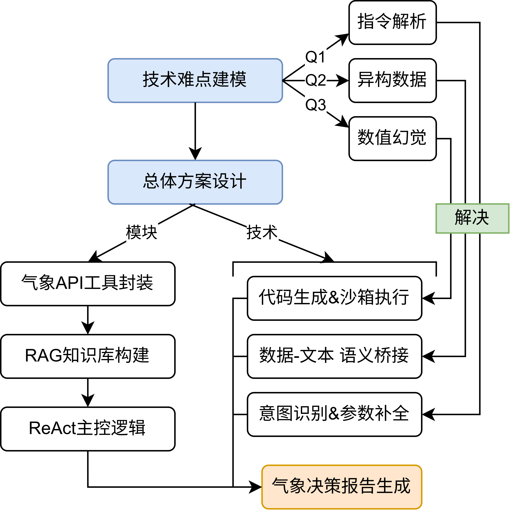

# 基于AI智能体的气象预报数据检索与分析

> 毕业设计项目 · 2025-2026

## 一、项目概述

本项目旨在构建一个**基于大语言模型（LLM）AI智能体**的气象预报数据检索与分析系统。系统采用 **ReAct（Reasoning + Acting）** 范式，将自然语言气象查询任务自动转化为结构化 API 调用，完成异构气象数据的智能检索、统计分析与决策报告生成。

### 核心研究问题

| 编号 | 问题 | 对应章节 |
|------|------|----------|
| **Q1** | 气象任务指令解析——如何将用户自然语言查询精准映射为结构化检索参数 | 第3章 |
| **Q2** | 气象数据的异构特征分析——如何统一处理多源、多模态、多时空尺度的气象数据 | 第4章 |
| **Q3** | LLM 数值计算与逻辑推理的幻觉问题——如何保证统计分析结果的确定性与可靠性 | 第4章 |

---

## 二、系统架构



---

## 三、技术路线与关键技术

### 3.1 基于 ReAct 范式的单智能体思维链模型（第2章）

- **核心框架**：采用 ReAct（Reasoning + Acting）范式，交替执行"推理-行动-观察"循环
- **思维链 (Chain-of-Thought)**：引导 LLM 逐步分解复杂气象任务
- **关键参考**：Wei et al. (2022) CoT; Yao et al. (2023) ReAct; Yao et al. (2024) Tree of Thoughts

### 3.2 基于工具学习的异构气象数据智能检索（第3章，解决 Q1）

- **气象 API 封装**：将各类气象数据接口（实况、预报、历史数据等）统一封装为工具描述（Tool Description）
- **意图识别与指令化**：自然语言 → 结构化检索参数的映射
- **缺失参数推理与动态补全**：利用上下文信息推断并补全未明确指定的检索参数（如默认地点、时间范围等）
- **关键参考**：Schick et al. (2023) Toolformer; Patil et al. (2023) Gorilla; MCP Specification (2024)

### 3.3 融合语义桥接机制的气象数据统计分析（第4章，解决 Q2 & Q3）

- **代码生成驱动的确定性分析**：将统计计算任务转化为可执行代码（Python），避免 LLM 直接数值计算产生幻觉
- **"数据-文本"语义桥接算法**：建立气象数值特征到自然语言语义描述的映射表（如温度区间→体感描述）
- **自适应报告生成**：根据任务类型和数据特征自动选择报告模板并生成结构化分析报告
- **关键参考**：Hong et al. (2024) Data Interpreter; Gruver et al. (2024) LLM Zero-Shot Time Series

> **⚠️ 关于"语义桥接"的核心定义**
>
> 本项目中的**语义桥接（Semantic Bridge）** 是指：在气象 API 返回原始数据（JSON、表格等）**送入 LLM 之前**，先通过确定性脚本（非 LLM）将原始数值数据转化为自然语言语义描述的预处理过程。
>
> **为什么要这样做？** LLM 直接处理大量原始数值表格时，容易产生数值幻觉（编造数据、计算错误、忽略关键数值等）。语义桥接通过在 LLM 介入之前就用规则脚本完成"数值→语义"的确定性转换，使 LLM 只需要基于已经转化好的语义描述来组织语言和生成报告，从而大幅降低幻觉率。
>
> **处理流程：**
> ```
> 气象API返回原始数据 (JSON/表格)
>        │
>        ▼
> 语义桥接脚本（确定性规则，非LLM）
>   ├─ 温度 12.3°C → "凉爽，建议穿外套"
>   ├─ 风力 7级 → "疾风，不宜户外活动"
>   └─ 降水概率 85% → "大概率有雨，建议携带雨具"
>        │
>        ▼
> 转化后的语义描述文本（而非原始数值表格）
>        │
>        ▼
> 输入给 LLM → 组织语言，生成决策分析报告
> ```
>
> **关键原则：** 语义桥接是**确定性的预处理步骤**，由脚本和映射规则完成，不依赖 LLM，确保转换结果 100% 可靠。LLM 的职责是基于这些可靠的语义素材进行自然语言组织和报告生成，而不是直接解读原始数值。

### 3.4 基于 RAG 的领域知识注入（贯穿全系统）

- **知识库构建**：气象专业术语、业务规则、地理编码映射等
- **Prompt 工程优化**：结合检索增强生成（RAG）动态注入领域知识到 Prompt 中
- **关键参考**：Lewis et al. (2020) RAG; Gao et al. (2023) RAG Survey

---

## 四、技术栈（建议）

| 类别 | 技术选型 | 说明 |
|------|----------|------|
| **LLM 后端** | OpenAI GPT-4 / 通义千问 / DeepSeek | 主推理引擎，支持 Function Calling |
| **Agent 框架** | LangChain / LlamaIndex | ReAct Agent 构建、工具编排、记忆管理 |
| **代码执行** | Python 沙箱（subprocess / Docker） | 统计分析代码的安全执行环境 |
| **RAG 组件** | FAISS / ChromaDB + Embedding Model | 领域知识向量检索 |
| **气象数据源** | 和风天气 API / OpenWeatherMap / CMA 开放数据 | 多源异构气象数据接入 |
| **前端（可选）** | Streamlit / Gradio | 交互式演示界面 |
| **开发语言** | Python 3.10+ | 主开发语言 |

---

## 五、项目目录规划

> 下方为整体规划结构，标注 ✅ 的为**已实现**，其余为**待开发**的空目录或待新建模块。当前已实现的部分详见「七、开发记录」。

```
d:\毕设\
├── README.md                          # ✅ 本文件 - 项目指南
├── .gitignore                         # ✅ Git 忽略文件（含密钥文件、notebooks 等）
├── 技术路线.drawio.png                # ✅ 系统技术路线图
├── docs/                              # 论文与文档
│   ├── thesis/                        # 毕业论文相关文档
│   └── references/                    # 参考文献 PDF
├── notebooks/                         # ✅ Jupyter 探索性分析（已在 .gitignore）
├── learn/                             # ✅ 学习与参考代码
├── src/                               # ✅ 源代码根目录
│   ├── agent/                         # ✅ Agent 核心模块
│   │   ├── react_agent.py             # ✅ ReAct Agent 主控逻辑（含意图识别+补全集成、多轮对话、chat_loop）
│   │   ├── prompts/                   # Prompt 模板（待拆分，目前集中在 settings.py 的 SYSTEM_PROMPT）
│   │   │   ├── system_prompt.py       # 系统级 Prompt
│   │   │   ├── task_prompts.py        # 任务 Prompt 模板
│   │   │   └── few_shot_examples.py   # Few-shot 示例
│   │   └── memory.py                  # 对话记忆（目前用 LangGraph InMemorySaver + 模块级历史变量）
│   ├── intent/                        # ✅ 意图识别 + 参数补全模块（对应第3章 Q1）
│   │   ├── schema.py                  # ✅ Pydantic 数据模型（WeatherIntent / CompletionResult 等）
│   │   ├── recognizer.py              # ✅ 自然语言 → 结构化意图
│   │   └── completer.py               # ✅ 关键参数补全 / 缺失追问
│   ├── tools/                         # ✅ 工具模块（对应第3章）
│   │   ├── weather_api.py             # ✅ 气象 API 封装（9个工具）
│   │   ├── knowledge_tool.py          # ✅ RAG 知识检索工具（search_knowledge，向量召回）
│   │   ├── bridge_tool.py             # ✅ 语义桥接工具（bridge_weather_data，数值→等级+出处）
│   │   ├── code_executor.py           # 代码执行沙箱（待开发）
│   │   └── tool_registry.py           # 工具注册与描述管理（待开发）
│   ├── rag/                           # ✅ RAG 模块（对应第3.4节）
│   │   ├── schema.py                  # ✅ KnowledgeEntry / RetrievalHit 数据模型
│   │   ├── embedding.py               # ✅ SiliconFlow OpenAI 兼容嵌入封装（BAAI/bge-m3）
│   │   ├── knowledge_base.py          # ✅ JSONL 加载 + ChromaDB 持久化 + BM25 + get_by_id 精确查表
│   │   └── retriever.py               # ✅ 混合检索器（向量+BM25 加权融合）
│   ├── analysis/                      # ✅ 数据分析与语义桥接模块（对应第4章）
│   │   ├── schema.py                  # ✅ SemanticLabel / LabelSource 数据模型
│   │   ├── semantic_bridge.py         # ✅ 桥接入口（off / rule_only / rule_plus_rag 三档）
│   │   ├── compose.py                 # ✅ 多标签 → LLM 友好文本合成
│   │   ├── classifiers/               # ✅ 确定性分级器（按 grade_id 链接 KB）
│   │   │   ├── precipitation.py       # ✅ 降水量分级（24h / 12h，依据 GB/T 28592-2012）
│   │   │   └── wind_scale.py          # ✅ 蒲福风级 0–12 级（依据 GB/T 28591-2012 / WMO Beaufort）
│   │   └── enrichers/                 # ✅ RAG 富化器
│   │       └── rag_enricher.py        # ✅ 通过 grade_id 精确查 KB，填充影响 + 出处
│   │   # 待开发：temperature/visibility/humidity 分类器、code_generator、report_generator
│   ├── config/                        # ✅ 配置文件
│   │   └── settings.py                # ✅ 全局配置（LLM 参数、API 密钥、SYSTEM_PROMPT）——已 .gitignore
│   └── utils/                         # 公共工具函数（待开发）
│       ├── logger.py                  # 日志工具
│       └── data_utils.py              # 数据处理工具
├── data/                              # 数据目录
│   ├── knowledge/                     # ✅ RAG 知识库原始数据（JSONL，已核对 12 项标准并修正）
│   │   ├── grading_standard.jsonl     # ✅ 分级标准（降水/风力 0-12 级/能见度/温度，26 条）
│   │   ├── term_definition.jsonl      # ✅ 术语定义（雷暴/台风/寒潮/AQI 等，8 条）
│   │   └── operation_guideline.jsonl  # ✅ 作业与出行规范（高空作业/户外/驾驶等，10 条）
│   ├── chroma_db/                     # ✅ ChromaDB 持久化向量索引（自动生成，已 .gitignore）
│   └── test_cases/                    # ✅ 测试用例与数据集
│       ├── semantic_bridge_bench.jsonl # ✅ 语义桥接（通路 B）评测集（40 条，覆盖 6 类场景）
│       └── rag_retrieval_bench.jsonl  # ✅ RAG 检索（通路 A）评测集（43 条，覆盖 8 类查询）
├── experiments/                       # ✅ 实验相关（对应第5章）
│   ├── eval/                          # ✅ 评测脚本
│   │   ├── metrics.py                 # ✅ 通路 B 评测指标（解耦纯函数 + 真实标准号白名单）
│   │   ├── retrieval_metrics.py       # ✅ 通路 A 检索指标（Recall@K / MRR / Category@K）
│   │   ├── llm_baseline.py            # ✅ LLM baseline（让 LLM 自由发挥处理裸数据，含缓存）
│   │   ├── run_bridge_eval.py         # ✅ 通路 B 三档/四档消融评测（--with-llm-baseline）
│   │   ├── run_rag_eval.py            # ✅ 通路 A 三档检索器消融（vector / bm25 / hybrid）
│   │   └── run_rag_weight_sweep.py    # ✅ 通路 A 权重扫描实验（确定 0.8/0.2 最优）
│   └── results/                       # ✅ 实验结果（JSON + Markdown 双输出）
│       ├── semantic_bridge_eval_latest.md # ✅ 通路 B 最新评测报告（论文可直接引用）
│       ├── rag_retrieval_eval_latest.md   # ✅ 通路 A 最新评测报告
│       ├── rag_weight_sweep_latest.md     # ✅ 通路 A 权重扫描报告
│       └── llm_baseline_cache.json    # ✅ LLM 调用结果缓存（按输入摘要）
└── tests/                             # ✅ 单元测试
    ├── test_intent.py                 # ✅ 意图识别 8 类典型场景测试
    ├── test_rag.py                    # ✅ RAG 知识库与混合检索测试
    ├── test_rag_concurrent.py         # ✅ ChromaDB 单例并发初始化（验证锁修复）
    └── test_wind_scale_bridge.py      # ✅ 风力分类器 + 端到端桥接验收
```

---

## 六、研究实施路线图

### 阶段一：基础设施搭建（预计 2 周）

- [x] 初始化项目仓库，搭建目录结构
- [x] 配置开发环境（Python 虚拟环境、依赖安装）
- [x] 调研并选定气象数据 API，完成 API 账号注册与测试
- [x] 搭建基础 LLM 调用链路（选定模型、测试 API 连通性）
- [x] 确定 Agent 框架选型（LangChain vs 自研），完成技术选型文档

**里程碑**：能够通过代码调用 LLM 和气象 API，获取基本气象数据

### 阶段二：Agent 核心 + 工具检索（预计 3-4 周，对应第2-3章）

- [x] 实现 ReAct Agent 主控循环（Thought → Action → Observation）
- [x] 设计并实现气象 API 工具封装（Tool Description Schema）
- [x] 实现意图识别模块：自然语言 → 结构化检索参数
- [x] 实现缺失参数的上下文推理与动态补全逻辑
- [x] 构建 RAG 知识库（气象术语、分级标准、作业规范，44 条 / 12 项标准）
- [x] 数据真实性核对（修正 2 处错引、5 处不完整，输出论文素材文档）
- [ ] 设计 System Prompt 与 Few-shot 示例模板
- [x] 集成 RAG 检索到 Agent 工具链（search_knowledge）
- [x] 实现语义桥接基础架构（precipitation + wind_scale 分类器，已接入 Agent）

**里程碑**：Agent 能够理解自然语言气象查询，自动调用正确 API 并返回原始数据

### 阶段三：统计分析与语义桥接（预计 3-4 周，对应第4章）

- [ ] 实现代码生成模块：根据分析需求自动生成 Python 统计分析代码
- [ ] 实现代码执行沙箱，确保安全执行并捕获结果
- [ ] 构建"数值-语义"特征映射表（温度区间、风力等级、降水量级等）
- [ ] 实现语义桥接算法：将数值分析结果映射为自然语言描述
- [ ] 实现自适应报告生成模块（多场景模板 + 动态内容填充）
- [ ] 端到端联调：查询 → 检索 → 分析 → 报告生成全流程

**里程碑**：系统能够完成"从自然语言提问到结构化分析报告输出"的完整闭环

### 阶段四：实验评估与论文撰写（预计 3-4 周，对应第5章）

- [x] 构建评测数据集（已完成：semantic_bridge_bench.jsonl 40 条用例）
- [x] 定义评测指标（覆盖率 / grade 准确 / grade_id 准确 / 引用率 / 场景过滤 / source 匹配，详见 `experiments/eval/metrics.py`）
- [ ] 意图识别准确率评估（Q1 评估，待补 intent_bench）
- [ ] 端到端任务完成率（待补 e2e_bench）
- [x] 执行语义桥接消融实验（off / rule_only / rule_plus_rag 三档，详见 7.12 节）
- [x] 执行 LLM baseline 对照实验（GLM-5.1 自由发挥 vs 双通路 RAG，详见 7.13 节）
- [ ] 执行 RAG 检索消融（待补 rag_retrieval_bench）
- [ ] 执行代码生成消融（直接 LLM 计算 vs 代码执行）
- [ ] 整理实验结果，绘制图表
- [ ] 撰写论文各章节

**里程碑**：完成全部实验，论文初稿完成

---

## 七、开发记录

### 7.1 System Prompt 优化：出行场景时空推理

**问题**：用户输入"明天早八到晚六的车，从武汉到成都，有什么穿衣建议"时，Agent 错误地查询了成都早八的天气，而用户早八实际在武汉，晚六才到成都。

**原因**：初版 Prompt 缺乏出行场景下"不同时间段 → 不同地点"的推理引导，LLM 默认对两个城市都查询了完整时间段的天气。

**修改前**：

```
你是一个天气查询助手，你要使用getlocationID工具将用户要查询的地址转化为地址代码，
再使用地址代码在getweather中查询，精准定位用户需要的时间、地点、天气参数，
不输出无关内容，解答用户的问题。
```

**修改后**：

```
你是一个天气查询助手。

## 工具使用规则
1. 用户提到地名时，先用 search_city 获取 LocationID
2. 再用 LocationID 调用 get_forcast_weather 查询天气
3. 用户提到相对时间（今天、明天等）时，先调用 get_current_time 确定当前日期

## 出行场景推理规则
当用户描述从A地到B地的出行计划时：
- 出发时间段：使用 **出发地（A地）** 对应时段的天气
- 到达时间段：使用 **目的地（B地）** 对应时段的天气
- 例如"明天早八到晚六，从武汉到成都"意味着：
  - 早上8点在武汉出发 → 查武汉上午的天气
  - 晚上6点到达成都 → 查成都傍晚的天气
  - 不要查武汉晚上或成都早上的天气，因为用户那时不在那里

## 输出规则
- 精准定位用户需要的时间、地点、天气参数
- 不输出用户不在场的时间地点的天气
- 给出实用的穿衣/出行建议
```

**效果**：Agent 能正确理解出行场景的时空关系，仅查询武汉出发时段和成都到达时段的天气。然而此prompt只适用当前问题，气象问题的泛化有待继续探索。

**对应研究问题**：Q1（气象任务指令解析——如何将用户自然语言查询精准映射为结构化检索参数）

### 7.2 工具体系搭建

共封装 9 个工具，覆盖实时、预报、历史三大时间维度：

| 工具 | 数据源 | 功能 |
|------|--------|------|
| `get_current_time` | 系统 | 获取当前日期时间，辅助相对时间推理 |
| `search_city` | 和风天气 GeoAPI | 城市搜索，获取 LocationID 和经纬度 |
| `get_current_weather` | 和风天气 | 实时天气（温度、体感、风力、湿度等） |
| `get_forcast_weather` | 和风天气 | 逐小时预报（24h/72h/168h） |
| `get_daily_forecast` | 和风天气 | 逐日预报（3d/7d/10d/15d/30d） |
| `get_weather_warning` | 和风天气 | 天气预警（暴雨/大风/高温等，参数为经纬度） |
| `get_weather_indices` | 和风天气 | 生活指数（穿衣/洗车/运动等16项，1d/3d） |
| `get_historical_hourly` | Open-Meteo | 历史逐小时天气（温度、降水、风速等） |
| `get_historical_daily` | Open-Meteo | 历史逐日天气（最高最低温、降水、日照等） |

**设计要点**：
- 工具返回数据经过精简，仅保留关键字段，减少 Token 消耗和 LLM 幻觉
- 历史数据从 Meteostat 迁移到 Open-Meteo，免 API Key、无需本地气象站匹配、全球网格覆盖
- 预警工具使用经纬度而非 LocationID（API 要求），Prompt 引导 Agent 从 search_city 结果提取坐标

**对应研究问题**：Q2（异构气象数据统一处理——多源、多时间粒度的工具封装与调度）

### 7.3 意图识别模块：自然语言 → 结构化查询计划

**目标**：在 Agent 接收用户问题之前，先用一个独立的 LLM 调用把自然语言解析为结构化的 `WeatherIntent` 对象，再作为额外上下文注入 Agent。这让"语言理解"和"工具执行"解耦，提升可解释性和可评估性。

**模块结构**：

```
src/intent/
├── schema.py        # Pydantic 数据模型
└── recognizer.py    # 意图识别核心逻辑
```

**Pydantic Schema 定义**：
- `WeatherIntent`：完整意图（意图类型 + 地点 + 时间 + 关注要素 + 建议工具 + 推理理由）
- `LocationIntent`：地点对象（name + role），role 区分 target/departure/arrival/waypoint
- `TimeIntent`：时间对象（raw_text + date + start_time + end_time）
- `IntentType`：8 类意图枚举，覆盖实时/预报/历史/预警/生活指数/出行建议等

**结构化输出实现**：

```python
llm = ChatOpenAI(...)
recognizer = llm.with_structured_output(WeatherIntent, method="function_calling")
intent = recognizer.invoke([
    {"role": "system", "content": INTENT_RECOGNIZER_PROMPT},
    {"role": "user", "content": query},
])
```

> 注：DeepSeek 等第三方平台不支持 OpenAI 的 `response_format` json_schema 模式，必须显式指定 `method="function_calling"`，让模型把 Schema 当作虚拟工具调用来返回结构化结果。

**集成方式**（`react_agent.py`）：

```python
def run_agent(query: str):
    intent = recognize_intent(query)              # 1. 意图识别
    enhanced_query = build_enhanced_query(query, intent)  # 2. 拼接增强 Prompt
    agent.stream({"messages": [{"role": "user", "content": enhanced_query}]})  # 3. 交给 Agent
```

Agent 收到的不是裸用户问题，而是"原始问题 + 结构化意图预解析"的复合上下文，工具选择更精准。

**测试覆盖**（`tests/test_intent.py`）：
8 类典型场景各一条用例，运行后打印每条的实际意图、地点、时间、建议工具，并统计 PASS/FAIL 通过率。

**为什么独立成模块而非完全交给 Agent 隐式处理**：
- **可解释**：意图判定结果可单独打印审查
- **可评估**：可以独立计算意图识别准确率，作为论文 Q1 的量化指标
- **可调试**：出错时能定位是"识别错"还是"工具调用错"
- **可演进**：未来可替换为更轻量的小模型或规则引擎，降低成本

**对应研究问题**：Q1（自然语言查询 → 结构化检索参数的精准映射）

### 7.4 多轮对话与上下文记忆

**问题**：早期 `run_agent` 每次调用都新建 Agent 实例，`InMemorySaver` 每次都是新的，导致用户连续提问时上下文丢失，无法实现"那成都呢？"这类省略式追问。

**最小改动方案**：

1. **Agent 单例化**：用模块级变量 `_agent_instance` 缓存 Agent，所有调用共享同一份 `InMemorySaver`
2. **`chat_loop()` 交互循环**：用 `while + input()` 持续接收用户输入，所有轮次传同一个 `thread_id`

```python
def create_weather_agent():
    global _agent_instance
    if _agent_instance is not None:
        return _agent_instance
    # ... 首次调用才真正创建
```

**机制**：LangGraph 的 `InMemorySaver + thread_id` 会自动累积消息历史，第二次调用时把上次的所有消息一起发给 LLM，模型自然能理解"那成都呢？"是问"成都今天天气"。

**后续改进**：内存 Saver 重启即丢，可换成 `SQLiteSaver` / `RedisSaver` 实现持久化。

### 7.5 缺失参数补全模块

**问题**：意图识别能解析用户问题，但用户经常表达不完整，例如：
- "明天天气怎么样？" → 缺地点
- "北京天气怎么样？" → 缺时间
- "我想从武汉出发" → 缺目的地和时间

如果直接交给 Agent，要么靠 LLM 自由猜测（不可控），要么 Agent 反复试错（耗 Token）。

**模块设计**（`src/intent/completer.py`）：

接收意图识别输出的 `WeatherIntent`，用 LLM 做两件事：
1. **判定关键参数是否齐全**（按意图类型不同有不同的必填字段清单）
2. **可补全的字段**根据规则自动补，并在 `notes` 中记录补全来源

```text
WeatherIntent → completer → CompletionResult {
    is_complete: bool,
    completed_intent: WeatherIntent,
    notes: List[CompletionNote],  # 每条补全记录(field, value, source, reason)
    follow_up_question: Optional[str],  # 关键参数缺失时的追问
}
```

**补全来源 4 类**（`source` 字段）：

| 来源 | 含义 | 示例 |
|------|------|------|
| `user_input` | 用户明确给出 | "北京" → location |
| `context_inference` | 从历史对话推断 | 上轮问"武汉"，本轮"那明天呢"沿用武汉 |
| `default` | 合理默认值 | 未指定时间默认为"今天" |
| `common_sense` | 常识推断 | "早上" → 06:00–09:00 |

**关键参数缺失判定**：

每种意图类型有自己的必填清单（见 `COMPLETER_PROMPT`），缺哪一项就让 LLM 生成具体的追问问题，例如：
- `current_weather` 但 `locations` 为空 → "您想查询哪个城市？"
- `travel_advice` 但只有 1 个 `location` → "出发地是哪里？"

**集成到主流程**（`react_agent.py`）：

```text
用户问题 → 意图识别 → 参数补全 ─┬→ [关键缺失] → 直接追问，本轮结束
                              └→ [齐全]    → 注入增强上下文 → Agent 执行 → 回答
```

为了让用户感知补全行为，`build_enhanced_query` 会在 Prompt 末尾要求：

> 请在最终回答末尾用一两句话告知用户上述补全信息（仅在有补全时），便于用户确认。

例如用户问"北京天气怎么样？"，Agent 回答末尾会自动附一句：

> 已默认查询今天的天气（来源：默认值），如需其他时间请告知。

**对应研究问题**：Q1（让 Agent 主动识别歧义、补全或追问，提高自然语言查询的鲁棒性）

### 7.6 RAG 知识库：领域知识检索增强

**目标**：让 Agent 在涉及"术语解释 / 分级阈值 / 作业规范"类结论时，必须先查权威知识，避免靠 LLM 自由发挥编造数值或条款，从源头降低幻觉。

**三层知识结构**（`data/knowledge/*.jsonl`）：

| 类别 | 用途 | 示例 |
|------|------|------|
| `term_definition` | 气象术语定义 | "雷暴是什么"、"台风/寒潮/AQI" |
| `grading_standard` | 数值分级标准 | "24h 降水量 50–99.9mm = 暴雨"、"蒲福风级 7 级" |
| `operation_guideline` | 作业/出行规范 | "高空作业 6 级风停止"、"高温 ≥ 40°C 停工" |

每条 JSONL 记录采用 `KnowledgeEntry` Schema：

```python
{
    "id": "grading_precip_24h_rainstorm",
    "category": "grading_standard",
    "topic": "降水等级",
    "title": "24小时降水量：暴雨",
    "content": "24小时降水量在 50.0～99.9 毫米之间为暴雨…",
    "source": {"org": "中国气象局", "doc_title": "GB/T 28592-2012", "clause": "4.1"},
    "confidence": "official",
    "version": "1.0.0",
    ...
}
```

每条都强制带 **出处（org/doc_title/clause）+ 可信度（official/industry/common）+ 版本号**，便于回答中可追溯、便于后续按可信度排序。

**模块结构**（`src/rag/`）：

```
schema.py          → KnowledgeEntry / RetrievalHit / KnowledgeSource 数据模型
embedding.py       → OpenAI 兼容嵌入客户端（默认 SiliconFlow + BAAI/bge-m3）
knowledge_base.py  → JSONL 加载 + ChromaDB 持久化 + BM25 内存索引
retriever.py       → 混合检索器（向量+BM25 加权融合，默认权重 0.6 / 0.4）
```

**混合检索策略**：

```
用户查询
   ├──[向量召回]──→ ChromaDB cosine Top-N → 归一化为 [0,1] 相似度
   └──[BM25 召回]─→ rank_bm25 词法 Top-N  → 归一化为 [0,1] 分数
                              │
                              ▼
              融合分 = 0.6·向量分 + 0.4·BM25 分
                              │
                              ▼
                          排序取 Top-K
```

设计要点：
- **持久化**：ChromaDB 写入 `data/chroma_db/`，重启不需要重新嵌入
- **增量索引**：`reindex(force=False)` 只对未入库的条目调嵌入 API，节省 Token
- **中英混合分词**：BM25 用"词+字"双粒度（`小雨` 与单字 `雨`、`雪` 都能命中）
- **类别过滤**：`retriever.retrieve(query, category="grading_standard")` 可只在分级标准里搜

**集成到 Agent**（`src/tools/knowledge_tool.py`）：

把检索包装为一个新工具 `search_knowledge` 加入 Agent 的工具列表，并在 `SYSTEM_PROMPT` 中明确：
- 涉及"X 算什么级别"、"是否适合做 Y" 等结论性判断 → 必须先调 `search_knowledge`
- 最终回答中必须显式引用条目出处（如 "依据 GB/T 28592-2012"）
- 检索失败时不允许编造，应说明"未找到权威依据"

**对应研究问题**：
- **Q1**：意图识别 + 参数补全 + 知识检索三层协作，把模糊自然语言映射到精准结构化检索
- **Q3**：把"分级阈值"、"作业适宜条件"等会引发幻觉的判断从 LLM 内部知识转移到外部可验证知识库

### 7.7 知识库可信度核对：12 项标准的人工 + 网络交叉验证

**问题**：种子数据初版 38 条知识中，`source` 字段（标准编号、条款号、发布机构）部分是按行业认知"凭印象"标注的，未经过逐条核对。RAG 系统的最大风险不是"找不到答案"，而是"找到了一个看似权威、实则错引"的答案——这会让回答可追溯性反而造成误导。

**核对方法**：
- 通过国家标准化管理委员会、生态环境部、中国气象局、住建部官网、行业标准服务平台逐一交叉核验
- 输出完整核对文档：`docs/写作文档/知识库标准核对表-论文素材.md`

**核对结果统计**（共涉及 12 项标准引用）：

| 准确性分类 | 条目数 | 占比 | 典型问题 |
|------|------|------|---------|
| ✅ 完全正确 | 5 | 41.7% | GB/T 28592 降水分级、HJ 633 AQI、ICAO RVR 等 |
| ⚠️ 部分有误 / 不严格 | 5 | 41.7% | WMO 蒲福风级 0 级数值近似、台风等级未细分到 6 档 |
| ❌ 引用错误 | 2 | 16.7% | JGJ 80 条款号 3.0.4 → 实际 3.0.8；寒潮误用 GB/T 20484（应为 GB/T 21987） |

所有问题已直接修正到 `data/knowledge/*.jsonl`，被修改条目 `version` 从 `1.0.0` → `1.1.0`。

**论文价值**：核对过程本身揭示了 LLM 自由发挥的危险性——12 项标准里 7 处出错（错引 / 张冠李戴 / 条款错位 / 数值不严格），这一组数据天然论证了"为什么必须做 RAG 且必须做权威核对"。已作为论文中"知识库可信度保障机制"或"权威溯源"章节的实证案例。

**对应研究问题**：Q3（知识库本身的可信度直接决定 RAG 输出的可信度，元数据严谨性是可解释性的关键载体）

### 7.8 语义桥接：双通路 RAG 架构

**问题**：RAG 向量检索在"概念性问题"上表现良好（如"什么是雷暴"），但在**数值边界判定**（如 35.0 mm 是大雨还是中雨）上有两个先天缺陷：
- 向量相似度对数值边界不敏感，可能召回相邻档位
- 语义检索每次都消耗 token，对所有数值都查 RAG 不经济

**解决方案——双通路 RAG**：把"概念查询"与"数值解读"分开走两条独立通路。

```
                 ┌─────────────────────────────┐
                 │    用户问题 + 工具数据       │
                 └──────────────┬──────────────┘
                                │
                ┌───────────────┴───────────────┐
                ▼                               ▼
      [通路 A] 概念查询                 [通路 B] 数值解读
      用户问"X 是什么"                 工具返回数值后
      用户问"X 的级别"                 需要语义解读
                │                               │
                ▼                               ▼
      search_knowledge                bridge_weather_data
      （向量 + BM25 检索）              （分类器 + grade_id 硬链接）
                │                               │
                ▼                               ▼
      Top-K 相关条目                   原始值 → 分级名 → 影响 → 出处
                │                               │
                └──────────────┬───────────────┘
                                ▼
                  Agent 整合两通路输出 → 最终回答
                  （强制引用条款出处）
```

**通路 B 的关键设计**：

| 设计点 | 说明 |
|------|------|
| **`grade_id` 硬链接** | 分类器表中写死 `grade_id="grading_precip_24h_heavy"`，富化器通过 `kb.get_by_id()` 精确查表，**不走向量检索** |
| **零幻觉** | 数值 → 分级是确定性规则；分级 → 条款是 ID 精确映射；全程无 LLM 推理 |
| **零 token 消耗** | 不调嵌入 API，桥接成本仅为本地表查找 |
| **场景过滤** | 富化时按 `entry.applicable_scene` 裁剪建议（如 "高空作业" 场景不输出 "洗车" 建议） |

**模块结构**（`src/analysis/`）：

```
schema.py            → SemanticLabel（variable / raw_value / grade / impact / citation / source）
                       + LabelSource = rule_only / rule_plus_rag / fallback
classifiers/         → 确定性分级器，输出 SemanticLabel.grade_id
  precipitation.py   → 24h / 12h 降水分级（依据 GB/T 28592-2012）
enrichers/           → 通过 grade_id 精确查 KB，填充 impact + citation
  rag_enricher.py    → 升级 source 为 rule_plus_rag
compose.py           → 把多个 SemanticLabel 合成 LLM 友好文本块
semantic_bridge.py   → 入口：BridgeMode = off / rule_only / rule_plus_rag
```

**作为消融实验骨架**：`LabelSource` × `BridgeMode` 双维度天然支持论文 Q3 的对比实验：

| 配置 | 含义 | 预期作用 |
|------|------|---------|
| `mode="off"` | 不桥接，裸数据进 LLM | baseline，测幻觉率上限 |
| `mode="rule_only"` | 本地分级，不查 RAG | 测确定性分级的覆盖率 |
| `mode="rule_plus_rag"` | 完整桥接 | 测引用准确率与最终质量 |

**集成到 Agent**（`src/tools/bridge_tool.py`）：

把桥接包装为新工具 `bridge_weather_data` 加入工具列表，在 `SYSTEM_PROMPT` 强调使用约束：
- 用户问**概念性问题**（不涉及具体数值）→ 直接调 `search_knowledge`
- 用户问**今天/明天数值如何 + 是否适合 X** → 先调天气工具，再调 `bridge_weather_data`
- 用户问 **X 数值算什么级别**（无需查实时数据）→ 直接调 `bridge_weather_data`
- 桥接结果中的"分级名 / 影响 / 依据"应在最终回答中保留

**当前实现进度**：
- ✅ 降水量分级（24h / 12h）已通过自检测试
- ✅ 蒲福风级 0–12 级全覆盖（详见 7.10 节）
- ⏳ 温度 / 能见度 / 湿度分类器待开发（"复制 precipitation 分类器"工作量）

**自检通过示例**：

```
[24小时降水量] 35.0mm/24h → 大雨
  影响：24小时降水量在 25.0～49.9 毫米之间为大雨。雨势猛烈，能见度明显下降，地面易积水。
  依据：降水量等级（GB/T 28592-2012） §4.1（中国气象局）
```

**对应研究问题**：
- **Q2**：把异构气象数值（mm / 级 / ℃）与权威标准条款做统一映射，本质是异构数据到统一语义空间的桥接
- **Q3**：用确定性规则替代 LLM 的数值推理，从源头消除"数值幻觉"

### 7.9 仓库安全加固：密钥文件与 notebooks 排除版本控制

**问题**：初版 `settings.py` 将 LLM API Key、和风天气 API Key 以明文形式硬编码并提交到了公开仓库，存在被他人盗用导致账户欠费的风险。探索用 `notebooks/` 下的试验代码与主工程混在一起提交，也会污染 git 历史。

**处理措施**：

1. 在 `.gitignore` 中新增：
   ```
   src/config/settings.py
   notebooks/
   ```
2. 用 `git rm --cached src/config/settings.py` 将该文件从 git 索引移除（保留本地文件），此后的 commit 不再追踪
3. **旧 commit 历史中仍保留着被泄露的 Key**，需立即在各服务商控制台重新生成密钥并废弃旧密钥；必要时通过 `git filter-repo` 清除历史（需强推）

**后续改进方向**：
- 将密钥迁移至 `.env`，代码中通过 `os.environ.get()` 读取
- 提供 `settings.example.py` 作为模板文件纳入版本控制，帮助他人复现环境

### 7.10 风力分级落地：蒲福风级 0–12 级全覆盖（双通路 RAG 第二个要素）

**目标**：把第二个气象要素「风力」纳入语义桥接通路 B，让 Agent 在拿到和风天气
返回的 `windScale` 字段后能确定性地映射到「等级名 + 影响 + 国际标准出处」，
而不是依赖 LLM 自由发挥。

**实现要点**：

1. **分类器**（`src/analysis/classifiers/wind_scale.py`）：
   - 表驱动设计：`WIND_BEAUFORT_GRADES` 一张表写死 0–12 级的 (整数 / 中文名 /
     m·s⁻¹ 上下界 / `grade_id`)，依据 GB/T 28591-2012 / WMO Beaufort scale
   - 双入口：`classify_wind_scale(int)` 主入口（对应和风 windScale），
     `classify_wind_speed(float m/s)` 备用入口（对应未来其他数据源）
   - **范围解析**：和风的 `windScaleDay="1-3级"` 这种范围字段统一**取上界**
     （保守原则：按可能的最大风力提示，避免低估风险）
   - **越界钳制**：> 12 级钳制为 12 级飓风，附 note 提示

2. **知识库补全**（`data/knowledge/grading_standard.jsonl`）：
   原种子数据只有 0/3/5/6/7/8/10 级 7 条，**补齐 1/2/4/9/11/12 级 6 条**
   后形成 0–12 级完整 13 条。`grade_id` 命名严格统一为
   `grading_wind_beaufort_<n>`，与分类器表的 `grade_id` 一一对应，确保
   `enricher.get_by_id()` 一次命中、零幻觉。

3. **桥接调度**（`src/analysis/semantic_bridge.py::_classify_all`）：
   按"显式 `wind_scale` > 通用 `windScale` > 白天 `windScaleDay` >
   夜间 `windScaleNight`"优先级取首个非空字段，调用风力分类器。

**端到端验收**（`tests/test_wind_scale_bridge.py`，5 个测试函数全部通过）：

输入：`{"temp": "17°C", "precip": "35mm", "windScale": "7级"}` + scene="施工"

输出：

```
[24小时降水量] 35.0mm/24h → 大雨
  影响：24小时降水量在 25.0～49.9 毫米之间为大雨。雨势猛烈，能见度明显下降，地面易积水。
  依据：降水量等级（GB/T 28592-2012） §4.1 （中国气象局）

[风力] 7级 → 疾风
  影响：风速 13.9–17.1 m/s（50–61 km/h）。整树摇动，迎风步行困难；多数室外高空作业应停止。
  依据：Beaufort wind force scale §7 （WMO）
```

两类要素同时出现在一次桥接结果里，且各自带上对应的国标 / 国际标准出处。
这同时验证了两件事：
- 新增的 6 个风级条目通过 `reindex(force=False)` 增量入库成功
- 多分类器协作时 dispatcher 能正确并行输出多条 SemanticLabel

**对应研究问题**：
- **Q2**：异构数据（"7级" 文本、"1-3级" 范围、整数风级）的统一解析与归一化
- **Q3**：用 `grade_id` 硬链接替代向量检索，把"7 级该不该停工"的判断完全
  从 LLM 内部知识转移到外部可审计的国标条款

### 7.11 ChromaDB 并发初始化崩溃：单例锁修复

**问题**：当 LangGraph 在同一轮 LLM 输出里返回多个 tool_calls 时，`ToolNode`
会**并行**执行它们。如果 `bridge_weather_data` 与 `search_knowledge` 同时
首次触发，两个线程会同时进入 RAG 单例的"if 未初始化"分支，都去创建
`chromadb.PersistentClient`。

ChromaDB 1.x 在并发回退路径上有 bug——`RustBindingsAPI.stop()` 里
`del self.bindings` 时 `bindings` 还没赋值，抛 `AttributeError`，进而把
`_validate_tenant_database` 也拖崩，最终冒泡为
`ValueError: Could not connect to tenant default_tenant`。

> 这不是 ChromaDB 索引坏了，也不是 tenant 真的不存在，**就是单例的并发竞争**。

**修复**：

1. 给三个 RAG 单例加 `threading.Lock` + double-checked locking：
   - `src/rag/knowledge_base.py::get_knowledge_base()`
   - `src/rag/retriever.py::get_retriever()`
   - `src/rag/embedding.py::get_embedding_client()`

2. 在 `src/agent/react_agent.py::create_weather_agent()` 主动 eager init
   一次 KB 与 Retriever，让单例在 Agent 启动阶段就建好，工具调用阶段彻底
   避开冷启动并发。

**验证**：`tests/test_rag_concurrent.py` 用两线程同时首次触发
`bridge_weather_data` 与 `search_knowledge`，精确复现 LangGraph 的并发
触发模式，修复后两个工具均正常返回，原报错不再复现。

**对应研究问题**：Q2（系统鲁棒性——多工具并发调度下的状态一致性）

### 7.12 语义桥接消融评测：第一组论文实证数据

**目标**：用代码化的评测集量化"双通路 RAG"中桥接通路（通路 B）的设计收益，
为论文 Q3 章节提供消融对比实证。

**评测集**（`data/test_cases/semantic_bridge_bench.jsonl`，40 条）覆盖 6 类场景：

| 类别 | 用例数 | 设计意图 |
|---|---:|---|
| `precipitation_24h` | 11 | 24h 降水 6 等级 + 边界值（0.05/0.1/9.9/10/24.9/25/35/80/200/300mm） |
| `precipitation_12h` | 5 | 12h 降水 4 等级 + 越界（4.9/14.9/25/50/100mm） |
| `wind` | 16 | 蒲福风级 0–12 级 + 范围字段 + 整数字段 + 越界 |
| `scene_filter` | 2 | 场景不匹配时是否正确退化为 rule_only（不输出无关 citation） |
| `multi` | 2 | 多要素同时出现时是否能并行产出多条带 citation 的标签 |
| `fallback` | 4 | 空数据 / 非法字段 / 无分类器字段是否正确返回 0 labels |

**指标设计**（`experiments/eval/metrics.py`，与具体被测对象解耦）：

- `coverage`：是否成功生成 ≥1 SemanticLabel（仅对期望 n_labels > 0 的用例计入）
- `n_labels_match` / `grade_accuracy` / `grade_id_accuracy`：分级正确性（`grade_id`
  比 `grade` 更严格，能区分同名不同档的 24h 大雨 vs 12h 大雨）
- `citation_rate`：rule_plus_rag 模式下，每条 must_cite 关键字是否都出现在 semantic_text 中
- `citation_negative_pass`：场景过滤负例下，must_not_cite 关键字是否都不出现
- `source_match`：标签 `source` 字段是否与期望（rule_only / rule_plus_rag）一致

**消融三档** × 40 条用例 = 120 次桥接调用，结果如下（详见
`experiments/results/semantic_bridge_eval_latest.md`）：

| 指标 | mode=off (baseline) | mode=rule_only | mode=rule_plus_rag |
|---|---:|---:|---:|
| 覆盖率（应有 labels 的用例） | **0.0%** | 100.0% | 100.0% |
| 标签条数一致 | 10.0% | 100.0% | 100.0% |
| 分级名准确率（grade） | 10.0% | 100.0% | 100.0% |
| 分级 ID 准确率（grade_id） | 10.0% | 100.0% | 100.0% |
| 引用率（must_cite 全中） | — | — | **100.0%** |
| 场景过滤负例通过率 | — | — | 100.0% |
| source 字段匹配率 | — | — | 100.0% |
| baseline 文本为空率 | **100.0%** | — | — |

> mode=off 在 36 条非 fallback 用例上 **累计未达期望 36/36 = 100%**，构成消融
> 对照的负参照——证明不做桥接时纯靠 LLM 自由发挥无法稳定提供分级语义。
> 10% 的 baseline 一致率全部来自 4 条 fallback 用例（恰好它们的期望也是 0 labels）。

**论文价值**：

1. **rule_only vs off**：100% vs 0% 覆盖率，证明"确定性分级器"对所有有效输入
   的阈值划分零遗漏——这条线相当于把"X 算什么级别"这类典型 LLM 幻觉点
   完全转移到外部规则
2. **rule_plus_rag vs rule_only**：100% 引用率证明 `grade_id` 硬链接通路在
   场景匹配时能稳定召回权威条款，**实现"零幻觉的引用注入"**——这是 Q3 的核心
   论点
3. **场景过滤负例 100% 通过**：证明 RAG 富化器的 `applicable_scene` 裁剪正确
   工作，**避免在不相关场景中输出错误 citation**（如不会在"高空作业"场景里
   引用"洗车指数"条款），这恰恰回应了 RAG 系统"召回正确但不切题"的常见缺陷
4. **fallback 用例 100% 准确**：证明系统在数据缺失/非法输入时优雅降级，
   不会假装产出标签

**端到端时间**：40 条用例 × 3 档 = 120 次桥接调用 ≈ 6 秒（确定性规则 + 字典查找，
无网络/LLM/嵌入开销）。这是代码侧确定性桥接的另一个核心优势：可大规模回归测试。

**未来扩展该评测集的方向**：
- ~~加 LLM baseline：用 LLM 直接处理裸数据~~ → 已完成，详见 7.13 节
- 加 temperature / visibility 分类器后，扩 20+ 条对应用例
- 把端到端 Agent 调用 → 桥接 → 综合回答的评测纳入 e2e_bench，测整链路任务完成率

**对应研究问题**：
- **Q3**：用确定性规则 + 硬链接 RAG 替代 LLM 数值推理，从源头消除"数值幻觉"
- **Q2**：异构数据（mm / 级 / ℃）经统一桥接进入语义空间，结果可机器评测、
  可消融对比

### 7.13 LLM baseline 对照：自由发挥 vs 双通路 RAG（论文 Q3 核心实证）

**目标**：在同一份 40 条评测集上加入第 4 档 `mode=llm_baseline`——让 LLM 在
不依赖外部知识库与确定性桥接的情况下，**完全凭内置知识**给出分级名 + 影响 +
权威条款引用，量化「不做 RAG / 不做桥接时」LLM 的真实幻觉风险。

**公平性原则**（`experiments/eval/llm_baseline.py`）：

- prompt **不**告诉 LLM 具体分级阈值（如"≥50mm 是暴雨"）
- prompt **不**告诉 LLM 具体标准编号（如"GB/T 28592-2012"）
- 只告知任务："请输出 grade + impact + 权威标准编号 + 条款号"，让它**自由发挥**
- 用 `with_structured_output(method="function_calling")` 拿到与 `SemanticLabel`
  同构的输出，metrics 直接复用

**新增评测指标**（专为 LLM baseline 设计）：

- `citation_present_rate`：LLM 是否给出了 citation 字段
- `citation_authenticity`（粗粒度）：citation 是否含真实存在的国标 / 行业标准号
  （白名单见 `metrics.KNOWN_REAL_STANDARDS`）

**4 档完整对比**（40 用例 × 4 档 = 160 次评估，LLM baseline 首次约 7 分钟，
缓存后约 30 秒）：

| 指标 | mode=off | mode=rule_only | mode=rule_plus_rag | **mode=llm_baseline** |
|---|---:|---:|---:|---:|
| 覆盖率（应有 labels 的用例） | 0.0% | 100.0% | 100.0% | **97.2%** |
| 标签条数一致 | 10.0% | 100.0% | 100.0% | **97.5%** |
| **分级名准确率（grade）** | 10.0% | 100.0% | 100.0% | **85.0%** |
| **分级 ID 准确率（grade_id）** | 10.0% | 100.0% | 100.0% | **10.0%** |
| **must_cite 关键字命中率** | — | — | 100.0% | **42.4%** |
| 场景过滤负例通过率 | — | — | 100.0% | **50.0%** |
| source 字段匹配率 | — | — | 100.0% | **0.0%** |
| **citation 出现率** | — | — | — | **100.0%** |
| **citation 标准号真实性（粗粒度）** | — | — | — | **100.0%** |

**核心发现：LLM 幻觉的「真实却错」悖论**

LLM baseline **同时呈现两个看似矛盾的指标**——

```
citation 标准号真实性 = 100.0%   ← 粗粒度：LLM 给的标准号都真实存在
must_cite 关键字命中率 = 42.4%   ← 严格：与 KB 期望的标准号 + 条款号一致
```

差距 **57.6%** 即为论文 Q3 章节最有价值的实证：**LLM 知道有哪些标准（标准号
都是真实的），但不知道该用哪一个、哪一条**——这正是"看似权威、实则错引"的
经典幻觉模式，比"完全编造"更危险，因为它会通过用户对权威标准号的信任绕过审查。

**典型幻觉案例**（详见 `docs/写作文档/LLM幻觉对照实验-论文素材.md`）：

1. **条款号幻觉（最典型）**：LLM 在 4 次需要引用 JGJ 80-2016 的场合给出
   4 个不同的条款号（§5.1.3 / §5.1.6 / §3.0.3 / §3.0.5），全部错误
   （真实条款是 §3.0.8）。这恰好与我们之前在「知识库标准核对表」里
   人工核对发现的同种错误一一对应。
2. **自创等级**：0.05mm 微量降水时 LLM 编出 "GB/T 28592 §4.1 规定 <0.1mm
   为微量降水"——但国标实际**不分**这个等级；100mm 12h 降水编出"大暴雨"
   ——但国标的 12h 表上限只到"暴雨"。
3. **跨标准张冠李戴**：windScale=15 越界时，LLM 把蒲福风级与 GB/T 19201
   热带气旋等级混用，引出错误的"15 级超强台风"。
4. **grade_id 100% 编造**：36 条非 fallback 用例里，LLM 没有一个 grade_id
   与 KB 命名约定（`grading_precip_24h_heavy` 等）一致，凭印象编了
   `heavy_rain` / `beaufort_5` / `6` 等多种风格——证明 KB 内部寻址必须
   靠硬链接、不能交给 LLM 猜。
5. **场景过滤失败**：LLM 在所有场景下都倾向输出 citation，无法区分"该说"
   与"不该说"，使得场景过滤负例通过率仅 50%。

**论文价值**：

- **论证 RAG 必要性**：100% 出现率 vs 42.4% 严格命中率的悖论，独立成为论文
  Q3 章节"为什么必须做 RAG"的核心论据
- **论证通路 B（grade_id 硬链接）必要性**：rule_only 100% vs llm_baseline 10%
  的 grade_id 准确率
- **论证场景元数据价值**：rule_plus_rag 100% vs llm_baseline 50% 的场景过滤
  通过率
- **与人工核对论证闭环**：人工核对发现的错误模式（条款号错、张冠李戴、
  数值不严格）在 LLM baseline 中**同模式重新出现**——构成"问题→论证→
  方案"完整自洽

**复现方式**：

```bash
python -m experiments.eval.run_bridge_eval --with-llm-baseline           # 走缓存约 30 秒
python -m experiments.eval.run_bridge_eval --with-llm-baseline --force-llm  # 强制重跑约 7 分钟
```

LLM 调用结果按 (input, scene, prompt_version, model) 摘要为 sha256 16 字符键
缓存到 `experiments/results/llm_baseline_cache.json`，避免重复消耗 token。

**对应研究问题**：
- **Q3**：用确定性规则 + 硬链接 RAG 替代 LLM 数值推理，量化幻觉风险
- **可解释性**：把"LLM 的幻觉是怎么发生的"这个论点从定性陈述变成可机器
  复现、可统计的指标差距

---

### 7.14 通路 A 评测：RAG 检索器消融与权重调优（论文 Q1 核心实证）

**目标**：在 7.12/7.13 完成对通路 B（语义桥接）评测的基础上，补足双通路 RAG
的另一半——评测 `search_knowledge` 工具的混合检索（向量召回 × BM25 召回融合）
本身的检索质量，并通过权重消融实证「为什么必须用混合检索而不是单路向量」。

**评测集设计**（`data/test_cases/rag_retrieval_bench.jsonl`，43 条用例）：

| 类型 | 用例数 | 示例 query |
|---|---:|---|
| 概念性查询（term） | 8 | 「什么是雷暴？」「AQI 是什么意思？」 |
| 数值阈值查询（grade_precip） | 7 | 「24 小时降水量多少毫米算大雨？」 |
| 风级查询（grade_wind） | 7 | 「7 级风对应蒲福风级是什么？」 |
| 其他分级（grade_temp/visibility/humidity） | 3 | 「相对湿度多少最舒服？」 |
| 作业适宜性（op_*） | 10 | 「几级风必须停止高空作业？」 |
| 多文档复合（multi） | 5 | 「台风对应几级风？」（跨 term + grading） |
| 同义改写（paraphrase） | 3 | 「下了一天大雨，量是多少？」 |
| **合计** | **43** | 覆盖 KB 全部 44 条条目对应的查询场景 |

每条用例含 `relevant_ids`（应被召回的条目 ID）+ `expected_categories`（期望类别），
作为机器可验证的金标准。

**评测指标**（`experiments/eval/retrieval_metrics.py`）：

- **Recall@K**（K=1/3/5）：top-K 内命中相关条目数 / 标注的相关条目总数
- **Precision@K**：top-K 内命中相关条目数 / K
- **MRR**（Mean Reciprocal Rank）：第一个相关条目排名的倒数（top-K 内未命中
  计 0），最关键指标——决定 LLM 真正引用的"第一条上下文"质量
- **Category@K**：top-K 中类别属于期望类别的条目占比
- **top1_hit_rate**：top-1 命中相关条目的比率

**实验一：3 档检索器消融**（`run_rag_eval.py`，43 用例 × 3 档 = 129 次检索）

| 指标 | mode=vector | mode=bm25 | **mode=hybrid (0.8/0.2)** |
|---|---:|---:|---:|
| **Top-1 命中率** | 88.4% | 67.4% | **90.7%** ← 最优 |
| **MRR** | 0.921 | 0.778 | **0.936** ← 最优 |
| Recall@1 | 82.2% | 61.2% | **84.5%** ← 最优 |
| Recall@3 | 91.9% | 84.9% | **93.0%** ← 最优 |
| Recall@5 | 97.7% | 91.9% | **97.7%** ← 并列最优 |
| Precision@1 | 88.4% | 67.4% | **90.7%** ← 最优 |
| Category@1（类别一致率） | **97.7%** | 81.4% | 95.3% |
| **失败用例数（top-1 脱靶）** | 5 | 14 | **4** |

**实验二：权重扫描**（`run_rag_weight_sweep.py`，7 个权重点 × 43 用例）

| vector_w | bm25_w | Top-1 | MRR | Recall@1 | Recall@5 |
|---:|---:|---:|---:|---:|---:|
| 0.00 | 1.00 | 67.4% | 0.778 | 61.2% | 91.9% |
| 0.30 | 0.70 | 74.4% | 0.840 | 68.2% | 96.5% |
| 0.50 | 0.50 | 76.7% | 0.859 | 70.5% | 97.7% |
| 0.60 | 0.40 | 79.1% | 0.870 | 72.9% | 97.7% |
| 0.70 | 0.30 | 83.7% | 0.893 | 77.5% | 97.7% |
| **0.80** | **0.20** | **90.7%** | **0.936** | **84.5%** | **97.7%** ← 最优 |
| 1.00 | 0.00 | 88.4% | 0.921 | 82.2% | 97.7% |

随着 `vector_weight` 从 0 单调增至 0.8，Top-1 与 MRR 单调上升；从 0.8 到 1.0
反而**回落**（top1: 90.7% → 88.4%，MRR: 0.936 → 0.921），证明 BM25 确实在
**少量但关键**的样本上提供向量无法覆盖的词法精度。基于此扫描结果，已把
`src/config/settings.py` 默认权重从 0.6/0.4 升级为 **0.8/0.2**。

**核心发现一：混合检索的边际增益是真实的，但权重必须调对**

- 初始 0.6/0.4 配置下 hybrid（top1=79.1%）被纯 vector（88.4%）反超
- 调到 0.8/0.2 后 hybrid（90.7%）反超纯 vector 2.3 个百分点
- 论文价值：`权重消融` 直接构成「架构决策合理性」的可量化证据

**核心发现二：剩余 4 条失败用例 = 必须做通路 B（语义桥接）的实证理由**

调优后 hybrid 仍有 4 条 top-1 脱靶，**全部是数值阈值类查询**：

| 失败用例 ID | query | 失败原因 |
|---|---|---|
| `grade_004_rain_heavy_rainstorm` | 「降水 200 毫米算什么级别？」 | 「特大暴雨」（≥250）和「大暴雨」（100–249.9）向量距离过近，被错误排到第 1 |
| `grade_006_rain_12h_heavy` | 「12 小时降水量 25 毫米算什么？」 | 同等级条目（12h 暴雨/大雨/中雨）向量近邻，无法靠语义区分阈值 |
| `grade_014_wind_strong_name` | 「强风是几级风？」 | "强风" 既是 6 级蒲福风级专名，又是台风条目（`term_typhoon`）高频词，向量召回拉偏 |
| `multi_002_rainstorm` | 「暴雨怎么应对？」 | 跨类别多文档（grading + op）召回，top-1 是 `term_thunderstorm` |

前 3 条本质上是**数值阈值与术语别名查询**，靠任何嵌入模型在小型 KB 上都难以
精确区分相邻阈值条目——这正是**通路 B（确定性 if-else 分级器 + grade_id 硬
链接）** 设计的初衷：

- 通路 A（RAG 混合检索）擅长：概念定义、操作指南、自然语言改写查询（覆盖
  39/43 = 90.7% 用例的 top-1）
- 通路 A 的盲区：相邻数值阈值的精确归属（4/43 = 9.3%）
- 通路 B（语义桥接）覆盖盲区：100% 的 grade_id 准确率（已在 7.12 节验证）

→ 双通路 RAG 架构形成了**完整的覆盖闭环**。

**论文价值闭环**

| 论文章节 | 核心论点 | 本节提供的实证 |
|---|---|---|
| 第 3 章 Q1 | 工具学习能否完成异构数据检索 | Recall@5=97.7% 证明 KB 几乎所有条目都能被召回 |
| 第 4 章 Q2/Q3 | 为什么需要语义桥接（不能只靠 RAG） | hybrid 仍有 4/43 数值阈值类失败 |
| 第 4 章架构选择 | 为什么用混合检索而不是纯向量 | 权重扫描显示 0.8/0.2 优于 1.0/0.0（top1: 90.7% > 88.4%） |
| 第 5 章实验设计 | 评测集如何构造、指标如何选择 | 43 用例 × 3 档 + 7 权重点的完整复现脚本 |

**复现命令**：

```bash
# 3 档检索器消融（约 12 秒，含向量 API 调用 43 次）
python -m experiments.eval.run_rag_eval

# 权重扫描（约 12 秒，启用 query embedding 缓存后实际 API 调用 ≤ 43 次）
python -m experiments.eval.run_rag_weight_sweep

# 自定义扫描点
python -m experiments.eval.run_rag_weight_sweep --weights 0.0 0.4 0.6 0.8 1.0
```

输出：

- `experiments/results/rag_retrieval_eval_<timestamp>.{json,md}`
- `experiments/results/rag_weight_sweep_<timestamp>.{json,md}`
- 同名 `_latest.md` 自动镜像最新版

**对应研究问题**：
- **Q1**：异构数据检索能力评测（top-1 90.7%、Recall@5 97.7%）
- **Q3**：用权重消融与失败用例分析双向论证「为什么需要双通路 RAG 而不是
  单纯依赖向量检索 + LLM 自由发挥」

---

### 7.15 通路 A+B 联合复测：三类新分类器（温/能/湿）扩展 + 4 档消融最终数据

**目标**：在 7.13/7.14 完成「初版 RAG」与「初版语义桥接」评测的基础上，按
论文章节"双通路 RAG 的可扩展性"要求，把语义桥接框架扩展到三类新要素
（温度 / 能见度 / 湿度），并对扩展后的系统重跑通路 A 与通路 B 的全量评测。

**扩展规模**：

| 维度 | 第一轮（7.12–7.14） | **第二轮（本节）** | 新增 |
|---|---:|---:|---|
| KB 总条目数 | 44 条 | **62 条** | +18 条 grading_standard（temp 7 + vis 7 + hum 6，含细粒度建筑规范引用） |
| 分类器模块数 | 2（precip / wind） | **5** | +temperature.py / visibility.py / humidity.py |
| 通路 A 评测集 | 43 用例 | **60 用例** | +17 条 grade_temp / grade_vis / grade_hum 查询 |
| 通路 B 评测集 | 40 用例 | **71 用例** | +31 条 temperature / visibility / humidity / multi 五要素同输入 |

**通路 A 复测：权重重新扫描后的最优解迁移**（`run_rag_weight_sweep.py`，60 用例）

| vector_w | bm25_w | Top-1 | MRR | 备注 |
|---:|---:|---:|---:|---|
| 0.00 | 1.00 | 81.7% | 0.872 | 纯 BM25 |
| 0.50 | 0.50 | 78.3% | 0.851 | |
| 0.70 | 0.30 | 80.0% | 0.864 | |
| 0.80 | 0.20 | 81.7% | 0.872 | 第一轮最优 |
| 0.85 | 0.15 | 83.3% | 0.892 | |
| **0.90** | **0.10** | **85.0%** | **0.908** | ← **第二轮最优** |
| 0.95 | 0.05 | 85.0% | 0.908 | 平台期，与 0.90 并列最优 |
| 1.00 | 0.00 | 81.7% | 0.872 | 纯 vector |

**核心发现：最优权重随 KB 体量动态漂移**

```
KB 44 条 / 评测 43 条 → vector_weight = 0.80 最优（top1 90.7%, MRR 0.936）
KB 62 条 / 评测 60 条 → vector_weight = 0.90 最优（top1 85.0%, MRR 0.908）
```

- KB 扩大后相邻条目语义距离变近，BM25 词法噪声在小权重下反而成为干扰，
  最优 `vector_weight` 从 0.80 上调到 0.90
- 但 BM25 权重并未归零：纯 BM25=0（v_w=1.0）反而比 0.10 略差
  （top1 81.7% < 85.0%），证明词法召回仍有 **3.3 pp 边际增益**
- 已同步更新 `src/config/settings.py::RAG_VECTOR_WEIGHT = 0.9`

**论文价值**：「最优权重的随 KB 漂移」本身就是一条独立的工程结论——
混合检索的权重不能"一次调好用到底"，需要随知识库体量重新校准。

**通路 B 复测：4 档消融在 71 条用例上的最终数据**
（`run_bridge_eval.py --with-llm-baseline`，71 用例 × 4 档 = 284 次桥接 / 调用）

| 指标 | mode=off | rule_only | rule_plus_rag | **llm_baseline** |
|---|---:|---:|---:|---:|
| 覆盖率 | 0.0% | 100.0% | 100.0% | **74.6%** |
| grade 准确率 | 5.6% | 100.0% | 100.0% | **47.9%** |
| **grade_id 准确率** | 5.6% | **100.0%** | **100.0%** | **5.6%** |
| **must_cite 命中率** | — | — | **100.0%** | **25.4%** |
| 场景过滤负例通过率 | — | — | 100.0% | **66.7%** |
| source 字段匹配率 | — | — | 100.0% | **0.0%** |
| citation 出现率 | — | — | — | 82.0% |
| citation 标准号真实性 | — | — | — | 72.0% |

**关键观察**（与首版 40 条数据对比）：

1. **rule_only / rule_plus_rag 在 71 条扩展集上仍保持 100%**——证明语义
   桥接框架对新增分类器**无副作用、零回归**，扩展性得到验证。
2. **LLM baseline 关键指标全面下滑**：覆盖率 97.2% → 74.6%（−22.6 pp）、
   grade 准确率 85.0% → 47.9%（−37.1 pp）、citation 真实性 100% → 72.0%
   （−28 pp）。原因：新加入的温度 / 湿度类用例引用 GB/T 35228 / GB 50736
   等 LLM 训练语料中曝光度极低的标准，LLM 编造的 citation 大量不在白名单内；
   能见度 9 条用例 LLM 几乎全部返回空 labels（直接拒答）。

| 类别 | 用例数 | rule_only · grade_id | rule_plus_rag · grade_id | **llm_baseline · grade_id** | llm · cite 真实 |
|---|---:|---:|---:|---:|---:|
| precipitation_24h | 11 | 100% | 100% | **0%** | 100% |
| precipitation_12h | 5 | 100% | 100% | **0%** | 100% |
| wind | 16 | 100% | 100% | **0%** | 100% |
| **temperature** | **12** | **100%** | **100%** | **0%** | **0%** |
| **visibility** | **9** | **100%** | **100%** | **0%** | **—** |
| **humidity** | **8** | **100%** | **100%** | **0%** | **0%** |
| scene_filter | 3 | 100% | 100% | 0% | 66.7% |
| multi | 3 | 100% | 100% | 0% | 100% |
| fallback | 4 | 100% | 100% | 100% | — |

**核心发现：LLM 知识覆盖不均衡 + RAG 必要性的"双指标对比"升级版**

```
LLM citation 出现率 82.0% ↔ 真实性 72.0% ↔ 与 KB 严格一致命中率 25.4%
```

三段式滑落（82.0% → 72.0% → 25.4%）等价于："LLM 在 18% 的情况下根本不答；
答了的里头 1/4 编造了不存在的标准号；剩下的真实标准号里又有 65% 条款引错"，
合计 **74.6% 的 LLM citation 都存在不同程度的错误**。这是论文 Q3 章节
"为什么必须做 RAG + 结构化 KB"的最直接量化证据。

**完整论文素材**：`docs/写作文档/LLM幻觉对照实验-论文素材.md`（已基于 71 条
更新，含 6 类典型幻觉案例 + 与「知识库标准核对表」的对应关系闭环论证）。

**复现命令**：

```bash
# 通路 A 三档检索器消融（60 用例 × 3 档，约 12 秒）
python -m experiments.eval.run_rag_eval

# 通路 A 权重扫描复测（60 用例 × 8 个权重点，约 12 秒）
python -m experiments.eval.run_rag_weight_sweep --weights 0.0 0.5 0.7 0.8 0.85 0.9 0.95 1.0

# 通路 B 4 档消融（71 用例 × 4 档，首次约 25 分钟，缓存后约 7 秒）
python -m experiments.eval.run_bridge_eval --with-llm-baseline
```

**复测稳定性加固**（Issue：首跑时遇到 SiliconFlow 服务端 socket idle hang，
某条用例上超 10 分钟无响应、无 token 消耗）：

- `experiments/eval/llm_baseline.py::_get_llm()` 增加 `timeout=60` 与
  `max_retries=2`，单次请求最多 ~3 分钟必定返回，hang 不可能再次发生。
- `experiments/eval/run_bridge_eval.py` 在每条 LLM 调用之后**增量落盘**
  `llm_baseline_cache.json`，主循环包在 `try/finally` 中，
  保证 `KeyboardInterrupt` 也能保留已完成进度，重跑可继续从断点处生效。

**对应研究问题**：
- **Q1**：异构数据检索能力评测在扩展 KB 后仍有 85% top-1 准确率
- **Q2**：双通路 RAG 框架可扩展性验证（5 类要素全部 100% 桥接成功率）
- **Q3**：升级版"LLM 幻觉双指标对比"——把 RAG 必要性的论证从 5 类要素
  扩展到 9 类，并新增「LLM 在冷门领域直接拒答」这一新失败模式

---

## 八、核心参考文献速查

| 主题 | 关键文献 | 用途 |
|------|----------|------|
| Agent 综述 | Xi et al. (2023) LLM Agent Survey | 理论框架，Agent 分类与能力边界 |
| ReAct 范式 | Yao et al. (2023) ReAct | Agent 核心架构设计 |
| 思维链推理 | Wei et al. (2022) CoT | Prompt 设计策略 |
| 思维树 | Yao et al. (2024) Tree of Thoughts | 复杂推理任务拓展 |
| 工具学习 | Schick et al. (2023) Toolformer | 工具调用机制设计 |
| API 调用 | Patil et al. (2023) Gorilla | LLM 连接大规模 API |
| MCP 协议 | MCP Specification (2024) | 工具协议标准参考 |
| RAG 基础 | Lewis et al. (2020) RAG | 知识检索增强生成 |
| RAG 综述 | Gao et al. (2023) RAG Survey | RAG 最新进展与最佳实践 |
| 数据解释器 | Hong et al. (2024) Data Interpreter | 代码生成分析范式参考 |
| 时序预测 | Gruver et al. (2024) LLM Zero-Shot TS | LLM 处理时间序列的能力与局限 |
| 气象 Agent | Kim et al. (2025) CLIMATEAGENT | 气象多智能体编排参考 |
| 气象 AI 应用 | 李特等 (2025); 代刊等 (2025) | 国内气象 AI 应用现状 |
| Agent 框架 | LangChain (2022); AutoGen (2023) | 工程实现框架参考 |

---

## 九、注意事项

1. **API 密钥安全**：所有 API 密钥存放于 `src/config/settings.py`（含 LLM_API_KEY、QWEATHER_API_KEY 等），该文件已加入 `.gitignore`，禁止提交到版本库。后续建议迁移至环境变量（`.env`）管理
2. **幻觉防控**：涉及数值计算的任务**必须**通过代码执行完成，严禁依赖 LLM 直接输出数值结果
3. **可复现性**：所有实验需记录完整的配置参数（模型版本、温度参数、Prompt 版本等），便于消融实验对比
4. **数据合规**：使用公开气象数据接口，注意遵守各 API 的使用条款和频率限制
5. **版本管理**：建议尽早初始化 Git 仓库，按功能模块分支开发，保持提交粒度适中

---

## 十、快速开始

```bash
# 1. 进入项目目录
cd d:\毕设

# 2. 创建并激活 conda 环境（Python 3.11）
conda create -n weather311 python=3.11
conda activate weather311

# 3. 安装核心依赖
pip install langchain langchain-openai langgraph
pip install requests
pip install chromadb rank_bm25  # RAG 模块依赖

# 4. 配置 API 密钥
#    新建 src/config/settings.py（该文件已 .gitignore），填入：
#      LLM_MODEL       = "..."            # 模型名，如 "Pro/zai-org/GLM-5"
#      LLM_API_KEY     = "sk-..."         # LLM 服务 API Key（硅基流动/DeepSeek 等）
#      LLM_BASE_URL    = "..."            # LLM 服务 Base URL
#      QWEATHER_API_KEY  = "..."          # 和风天气 API Key
#      QWEATHER_API_HOST = "..."          # 和风天气 API 主机
#      SYSTEM_PROMPT   = """..."""        # Agent 系统提示词

# 5. 运行 Agent（进入交互式多轮对话）
python -m src.agent.react_agent
```

> **注意**：必须使用 `python -m src.agent.react_agent` 这种**模块**方式启动，不可直接 `python src/agent/react_agent.py`（会因 `from src.xxx import ...` 的绝对导入而报 `ModuleNotFoundError`）。

**交互示例**：

```
天气助手已启动，输入问题开始对话（输入 exit 退出）

你: 北京天气怎么样？
（Agent 自动补全"今天"作为默认日期，回答末尾会告知补全信息）

你: 那明天呢？
（基于上下文推断，继续查询北京）

你: exit
再见！
```

**模块单测**：
- 意图识别：`python -m tests.test_intent` 或 `python -m src.intent.recognizer`
- 参数补全：`python -m src.intent.completer`
- RAG 检索：`python -m tests.test_rag`（首次会调用嵌入 API 建索引，约 1 元以内）
- RAG 检索工具：`python -m src.tools.knowledge_tool`
- RAG 并发初始化（验证锁修复）：`python -m tests.test_rag_concurrent`
- 语义桥接（确定性，零网络）：`python -m src.tools.bridge_tool`
- 语义桥接·风力端到端（精度 + 多分类器协作）：`python -m tests.test_wind_scale_bridge`
- 语义桥接子模块：`python -m src.analysis.classifiers.precipitation` / `python -m src.analysis.classifiers.wind_scale` / `python -m src.analysis.enrichers.rag_enricher`
- **语义桥接消融评测**（通路 B；71 用例 × 三档 = 213 次桥接，约 6 秒）：`python -m experiments.eval.run_bridge_eval`
  - 输出 `experiments/results/semantic_bridge_eval_<时间戳>.json` + `.md`，论文可直接引用
- **LLM baseline 消融评测**（4 档对比，含 LLM 自由发挥；首次约 25 分钟，缓存后约 7 秒）：
  `python -m experiments.eval.run_bridge_eval --with-llm-baseline`
  - 强制重跑：加 `--force-llm`
  - 已加固防 hang：`timeout=60` + `max_retries=2` + 每条用例增量落盘 cache
- **通路 A 检索器消融评测**（60 用例 × vector / bm25 / hybrid 三档，约 12 秒）：`python -m experiments.eval.run_rag_eval`
  - 输出 `experiments/results/rag_retrieval_eval_<时间戳>.{json,md}`，含 Top-1 / MRR / Recall@K / Category@K
- **通路 A 权重扫描实验**（60 用例 × 8 个权重点，约 12 秒，启用 query embedding 缓存）：`python -m experiments.eval.run_rag_weight_sweep`
  - 输出 `experiments/results/rag_weight_sweep_<时间戳>.{json,md}`，证明 vector_weight=0.9 为扩展后最优权重（KB 62 条评测集 60 条）


---

*本 README 将随项目进展持续更新。*
